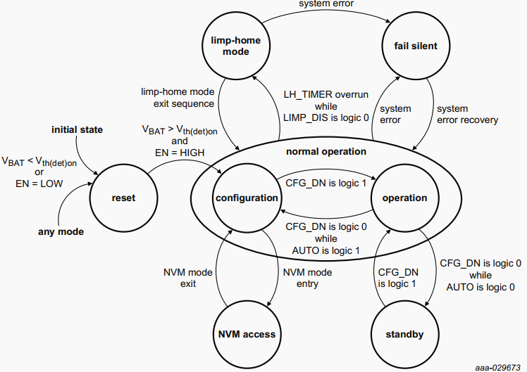
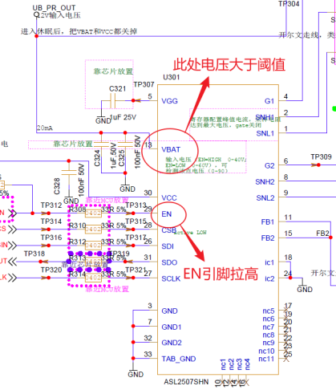
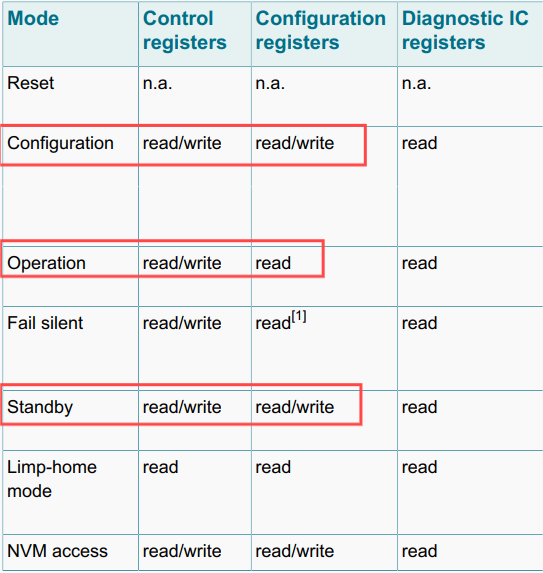
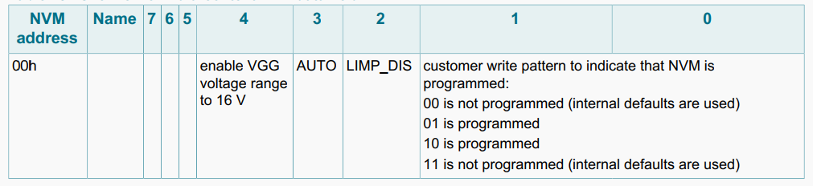

# 
ASLx507(ASL1507、ASL2507)初始化流程设计

## 背景介绍
### ASLx507简介
ASLx507是NXP的boost芯片ASL1507和ASL2507的总称，主要用于汽车灯光控制，常与NXP的buck芯片ASL241x同时使用。

### ASLx507状态机

  
 

### 开始工作的两个条件
1. VBAT引脚电压高于上电检测阈值电压V~th(det)on~(4.5V)
2. EN引脚拉高

  
 

### 寄存器访问

  
 

### 特殊寄存器

  
 

## 初始化流程设计

### V1.0初始化流程
1. 拉低EN引脚，防止调用ASLx507初始化函数之前EN引脚被拉高，进入不正常状态(limp-home, fail silent)，无法进行初始化
2. 拉高EN引脚，使ASLx507由**reset**状态进入**configuration**状态（VBAT正常供电的情况下）
3. 检测芯片状态，确认ASLx507已进入**configuration**状态
4. 执行 **NVM mode entry** 流程，进入**NVM access**模式
5. 读取NVM寄存器00H的值，并根据每个field的值为相应的全局变量赋值以待备用(初始化寄存器时**VGG电压配置范围**的判断、**mainfunction函数**中是否要刷新**limp-home寄存器**的判断)
6. 执行 **NVM mode exit** 流程，退出**NVM access**模式，重新进入**configuration**模式
7. 进行寄存器的配置
8. 转换状态至**operation**模式
9. 确认ASLx507成功进入**opreation**模式之后结束初始化流程

### V2.0初始化流程

修改初始化流程原因： 
&emsp;&emsp;出于功能安全角度考虑，要求MCU挂掉之后ASLx507仍有输出(保持车灯不会因MCU挂掉而突然熄灭)。因此，要求ASLx507的EN引脚不能直接由MCU的IO引脚控制。
  

初始化流程修改项： 
&emsp;&emsp;由于此时产品线硬件设计并未想出更好的方案操控EN引脚，只要求驱动中不存在对EN引脚的控制。因此，相对上一版本的初始化流程并未做出太大改动，只是删除了对EN引脚的控制。但同时对ASLx507的初始化函数的调用有了一定的要求。  

初始化流程修改后注意事项： 
&emsp;&emsp;必须在初始化之前设法将EN引脚拉高，且EN引脚拉高时间不能过早，最好在调用ASLx507初始化函数的前一个步骤进行EN引脚的拉高。
 

### V3.0初始化流程

修改初始化流程原因： 
&emsp;&emsp;产品硬件修改，ASLx507的EN引脚通过上拉电阻直接于电源相连，且产品软件需使能limp-home模式，导致ASLx507提前开始工作，且未在一定时间内执行mainfunction函数进行limp-home寄存器的刷新。从而导致ASLx507在执行初始化函数之前就进入limp-home状态，无法正常进行初始化流程。
  

修改初始化流程注意事项： 
1. 需加入对ASLx507是否处于limp-home模式的判断，若处于limp-home模式，需执行退出该模式的流程 
2. 需在EB界面增加配置项：①是否在初始化流程中读取NVM寄存器00H的值 ②NVM寄存器00H的值(此配置项仅在上一个配置项为"否"时生效) 
3. 由于ASLx507的状态机转换流程可能存在： 
&emsp;&emsp;reset ―> configuration ―> limp-home(未及时刷新limp-home寄存器) ―> operation(NVM寄存器组配置退出limp-home模式后进入operation模式) ―> standby(NVM寄存器00H的AUTO位置0，无法从operation转换置configuration模式) 
&emsp;&emsp;因此，需允许在standby模式下进行寄存器的配置
  

修改后的初始化流程：
1. 判断需要在初始化流程中读取NVM寄存器00H的值
2. 若需要在初始化流程中读取NVM寄存器的值，则执行"NVM mode entry"流程，进入"NVM access"模式，读取NVM寄存器00H的值后，执行"NVM mode exit"流程，退出"NVM access"模式
3. 检测ASLx507是否处于limp-home状态,若处于limp-home状态，则执行退出limp-home的流程
4. 读取ASLx507的当前状态
5. 若当前处于"operation"模式，则将CFG_DN位置0
6. 若当前处于"configuration"或"standby"模式，则进行一步，否则跳转至"流程4"(等待状态转换的过程应该设置读取次数的限制)
7. 进行配置寄存器的配置
8. 转换状态至**operation**模式
9. 确认ASLx507成功进入**opreation**模式之后结束初始化流程

## 举一反三
对于设计有NVM寄存器的芯片，在进行驱动软件设计时，需要考虑其在功能安全领域的应用。对于该类芯片的驱动，需考虑好如何在控制输出或状态转换的引脚不受MCU的IO控制的情况下，如何进行软件设计。