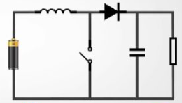
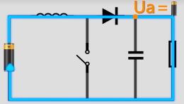
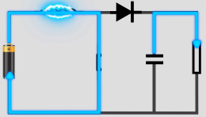
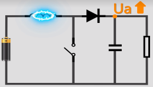
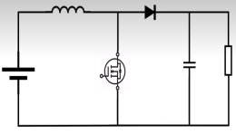

# 
Boost基础知识
## 一、Boost电路介绍
Boost电路是一种开关直流升压电路，能够使输出电压大于输入电压。其简化原理图如下。 

  
 

## 二、Boost电路中元器件特性
### 1.电容电感特性
*电容阻碍电压变化，通高频，阻低频，通交流，阻直流*
*电感阻碍电流变化，通低频，阻高频，通直流，阻交流*
### 2.二极管特性
boost电路中二极管起到稳压的作用。
正接时二极管相当于导线，反接时二极管处相当于断路。

## 三、Boost电路工作原理
### 1.Boost电路开关断开
如图，当开关断开时电路导通，此时电容充电，电阻两端电压等于电源电压。

  
 

### 2.Boost电路开关闭合
如图，当开关闭合时电路导通，此时电感充电，电容放电，电阻两端仍有电压存在。
由于二极管的存在，左右两端的电路互不干扰。即使二极管左侧接地电压小于右侧，仍不会有电流流过二极管。

  
 

### 3.Boost电路开关断开
如图，当开关再次断开时，电感放电，电容充电，电阻两端电压等于电源电压加上电感电压。

  
 

### 4.开关反复闭合与断开
循环进行步骤2和步骤3，且开关闭合断开频率足够快时，电阻上电压始终大于电源电压，达到输出电压大于输入电压的目的。

## 四、Boost电路图
如图，实际上用MOS管代替简化电路的开关。

  
 

## 五、注意事项
能量是守恒的，Boost电路在升压的同时降低了电路中的电流。如干电池的电压是1.5V，最大电流2A，通过Boost电路升压值12V后电路中的最大电流变成了1.5 * 2 / 12 = 0.25A。

