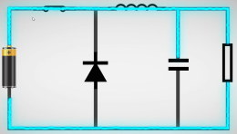
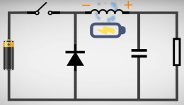
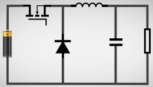

# 
Buck基础知识
## 一、Buck电路介绍
Buck电路是一种开关直流降压电路，能够使输出电压小于输入电压。其简化原理图如下。 

  
 

## 二、Buck电路中元器件特性
### 1.电容电感特性
电容阻碍电压变化，通高频，阻低频，通交流，阻直流
电感阻碍电流变化，通低频，阻高频，通直流，阻交流
### 2.二极管特性
buck电路中二极管起到稳压的作用。
正接时二极管相当于导线，反接时二极管处相当于断路。

## 三、Buck电路工作原理
### 1.Buck电路开关闭合
如图，开关闭合时，电容电感充电，由于电感阻碍电流的变化，从开关闭合至电路中电流稳定的过程中电阻两端电压缓慢增大，且此过程中输出电压小于输入电压。

  
 

### 2.Buck电路开关断开
如图，开关断开时，电容电感放电，由于电容阻碍电压的变化，电阻两端电压缓慢减小。

  

  
 

### 3.Buck电路开关反复闭合断开
Buck电路中开关反复闭合断开，且开关频率较高时可达到输出电压小于输入电压，且稳定在一定范围的效果。输入输出电压变化图如下。

  
 

==开关闭合断开的频率越高，输出电压越稳定==
==开关闭合时间 / （开关闭合时间 + 开关断开时间） 称为**占空比**，占空比越小，输出电压越小。==

## 四、Buck电路图
如图，实际上用MOS管代替简化电路的开关。

  
 

## 五、电路改进
由于二极管导通时有固定0.4V的压降，故当电流1A时，二极管会有0.4W功耗。如图，用MOS管代替二极管可以降低功耗，提高电路热效率，使用时只需保证电路中两个二极管同时只有一个导通一个关闭即可。

  
 

==使用二极管的电路称为**异步整流电路**。==
==使用MOS管代替二极管的电路称为**同步整流电路**。==
同步整流要比异步整流效率高，发热低。