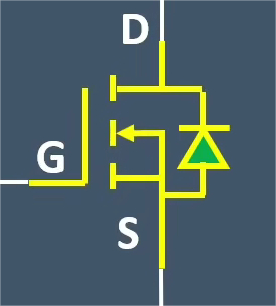
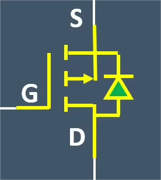
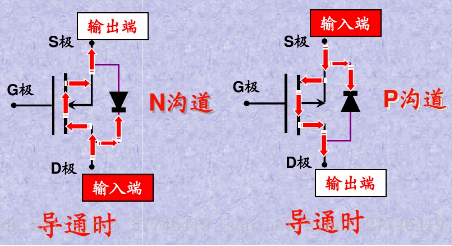

# 
MOS管基础知识
## 一、分类
1. N沟道MOS管 
  
  

2. P沟道MOS管
   
  
 

**注：**
==箭头指向G极的是N沟道MOS管==
==箭头指离G极的是P沟道MOS管==

## 二、电极
* G极（Gate）—— 栅极，控制电路的通断
* S极（Source）—— 源极，两根线相交的是源极
* D极（Drain）—— 漏极，单根线的是漏极

## 三、导通时电流流向
- N沟道MOS管：D极 ——> S极
- P沟道MOS管：S极 ——> D极

**所以，MOS管作开关作用时：**
- **NMOS管D极接输入，S极接输出**
- **PMOS管S极接输入，D极接输出**

==即，寄生二极管负极接输入端，正极接输出端==

  
  
 

==MOS管导通时电流流向与寄生二极管导通方向相反==

## 四、MOS管导通条件
- NMOS管导通：U~G~ > U~S~
- PMOS管导通：UG < US
