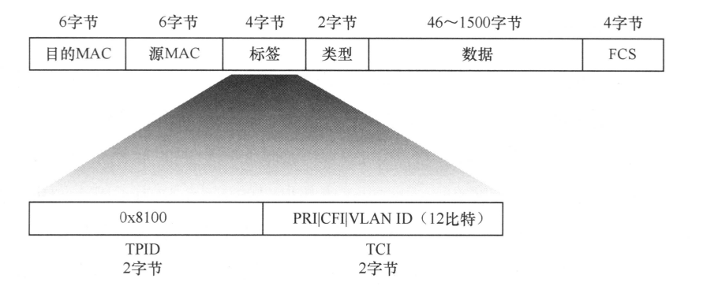
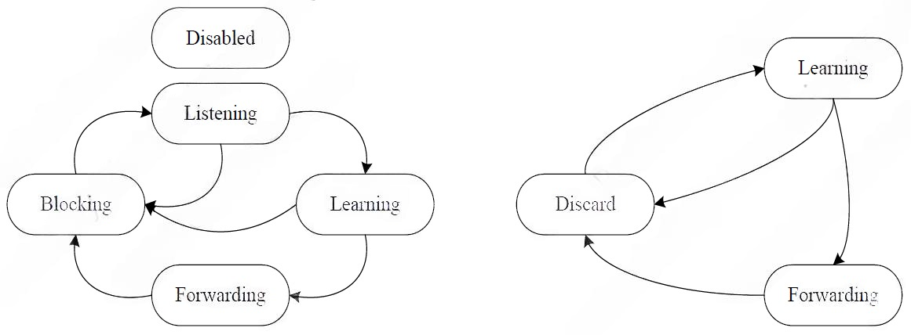
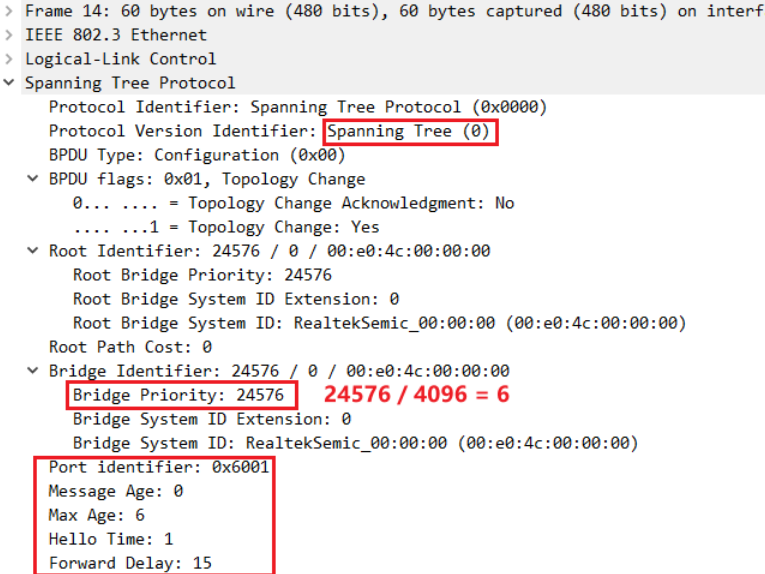
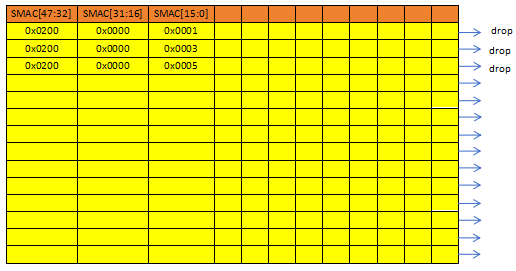

# 
交换机基础
&emsp;&emsp;交换机工作在数据链路层，对数据帧进行操作。在收到数据帧后，交换机会根据数据帧的头部信息对数据帧进行相应动作。

## 一、VLAN
&emsp;&emsp;VLAN（Virtual Local Area Network）即虚拟局域网，是将一个物理的LAN在逻辑上划分成多个广播域的通信技术。每个VLAN是一个广播域，VLAN内的主机间可以直接通信，而VLAN间则不能直接互通。这样，广播报文就被限制在一个VLAN内。

### VLAN数据帧
&emsp;&emsp;IEEE 802.1Q协议规定，在以太网数据帧中加入4个字节的VLAN标签（又称VLAN Tag，简称Tag），用以标识VLAN信息。VLAN数据帧又被称为802.1Q帧。
&emsp;&emsp;VLAN数据帧的帧格式如下图所示

  

- **TPID (标签协议标识符)：** 长度为2字节，取值为0x8100，用来表示这个数据帧携带了802.10标签。不支持802.10标准的设备在收到这样的数据帧后,会把它丢弃；
- **TCI (标签控制信息):** 长度为2字节,又细分为以下3个子字段,用来表示数据帧的控制信息
  - **优先级(Priority):** 长度为**3比特**,取值范围 **[0:7]**,用来表示数据帧的优先级。优先级取值越大,数据帧的优先级越高。当交换机发生拥塞时,它会优先处理优先级高的数据帧；
  - **CFI (规范格式指示器):** 长度为**1比特**,取值非0即1。CFI取值为0表示MAC地址以标准格式进行封装，为1表示以非标准格式封装。在以太网中，CFI的值为0。此位在有些地方也以**DEI**位相称。
  - **VLAN ID (VLAN标识符):** 长度为12比特, VLAN ID的作用顾名思义,这个字段的数值即为VLAN标签的数值。取值范围 **[0:4095]**，由于0和4095为协议保留取值，所以VLAN ID的有效取值范围是 **[1:4094]**。

### 缺省VLAN
&emsp;&emsp;缺省VLAN又称**PVID**(Port Default VLAN ID)，指某一Pot默认的VID。交换机处理的数据帧都带Tag,当交换机某个Port收到Untagged帧时,就需要给该帧添加Tag，添加什么Tag，就由该Port的缺省VLAN，即决定该Port默认的VID决定。
&emsp;&emsp;当不进行交换机的VLAN配置时，默认交换机内部配置VID为1的VLAN，此VLAN包括交换机所有Port,所以交换机每个Port的缺省VLAN一般默认都为1，且默认无论收到的数据帧是否为带VLAN的数据帧，都使用Port的缺省VLAN。
&emsp;&emsp;Port的缺省VLAN以及对于输入Port的带VLAN标签的数据帧的处理，是优先使用原VLAN还是该Port的缺省VLAN。这些都是可以配置的。在市面上的成品交换机中通常将交换机的端口分为access和trunk两种类型的端口，用配置是否优先使用端口的缺省VLAN对数据帧进行处理。但在进行Switch芯片驱动程序的编写时并不需要区分这些概念，因为这种端口的分类只是对端口VLAN配置的组合。

## 二、端口隔离
&emsp;&emsp;端口隔离顾名思义，就是将两端口隔离开。如配置交换机的端口隔离功能，Port1隔离Port2，则Port1收到的数据不再向Port2进行转发，但Port2收到的数据确不受影响，仍可以转发到Port1。若同样想让Port2收到的数据不再向Port1转发，则配置Port2隔离Port1即可实现。

&emsp;&emsp;端口隔离的优先级要高于VLAN，即使Port1与Port2属于同一VLAN，但只要配置了Port1隔离Port2，则Port1收到的数据就不会向Port2进行转发。

&emsp;&emsp;端口隔离(也称为私有VLAN)允许交换机灵活地限制流量。任何两个物理端口之间的两个方向的流量都可以被单独阻塞，即使在同一个VLAN内也可以同时阻塞。对于连接到最终用户的交换机，端口隔离是网络资源管理的一个有用特性。通常，除了连接服务器、路由器或防火墙的端口外，所有端口都被配置为相互隔离。然后将所有报文发送到指定端口，并进行正常转发。需要注意的是，镜像流量和被捕获到CPU的报文不能通过此功能进行隔离。

## 三、流量控制
&emsp;&emsp;交换机在传输以太网报文时采用存储-转发的策略。当端口接收到报文时，先将报文存储在缓冲区，再进行转发。如果端口接收的以太网数据帧来不及转发，接收缓冲区就会逐渐被填满，之后端口收到的数据帧就会被丢弃。交换机的流量控制功能就是为了防止这种情况的发生，当缓冲区快满时向外发送暂停帧，使数据的发送方暂时停止发送。

### 暂停帧
&emsp;&emsp;在IEEE802.3协议中规定中，PAUSE帧是一种控制帧，用于控制数据流停止发送，在MAC发送侧产生，在MAC接收侧解析并执行。当此端设备输入数据量过大，无法及时处理时会在此端发送侧MAC产生PAUSE帧，发给对端，要求对端在一定时间内停止发送数据。

&emsp;&emsp;在全双工MAC控制框架下，流量控制机制是通过PAUSE功能实现的。如果某个端口要停止帧的接收，可以发送一个带有时间参数的PAUSE帧，参数指示全双工链路对方在开始发送数据前需要等待的时间，收到PAUSE帧的设备通过简单的解析，就可以确定停止发送的时长。当链路对方接收到PAUSE帧后，在参数指定的时间内停止发送数据。当指定时间超出，或原拥塞端口重新发出操作参数为0的PAUSE帧，链路对方从暂停的位置继续发送数据帧。

&emsp;&emsp;暂停帧格式：

目的MAC字段 + 源MAC字段 + 类型字段 + 操作码字段 + 操作参数字段 + 数据位字段 + FCS字段

- **目的MAC字段：** 6字节，固定为**01-80-C2-00-00-01**（组播地址）
- **源MAC字段：** 6字节，交换机MAC地址
- **类型字段：** 2字节，固定为**0x8808**
- **操作码字段：** 2字节，固定为**0x0001**
- **操作参数字段：** 2字节，范围为 **[0x0000 : 0xFFFF]** ，表示暂停时间，单位是当前传输速率传512bit（最小以太网帧）的时间。
- **数据位字段：** 12字节，即以太网帧传输数据，在暂停帧中此字段保留，即全0
- **FCS字段：** 4字节，校验和字段，发送数据时自动计算

## 四、风暴控制
&emsp;&emsp;当不必要的报文涌入局域网，占用网络资源，导致网络性能下降，有时甚至导致网络服务完全关闭时，就会产生流量风暴。交换机支持风暴控制功能，可以监控进入流量级别，并在超过特定流量级别时丢弃特定流量，包括广播、组播(已知，未知两种)和未知单播报文。
&emsp;&emsp;风暴控制要素：
- **速率阈值：** 即最大输入端口流量的最大输入速率，超过此值之后，交换机端口会丢弃一部分输入流量，使得端口输入流量的速率保持在此值。
- **突发传输大小：** 此值通常大于**速率阈值**，当端口输入流量突然增大，大于**速率阈值**，但小于此值时，不会立即触发交换机的风暴控制功能，经过一段时间后仍大于**速率阈值**，就会触发交换机的风暴控制功能。**突发传输大小**的存在相当于，加了一道缓冲，允许流量突增之后立即减小的情况发生。
- **风暴控制的单位：** 指示风暴控制的单位，**速率阈值**和**突发传输大小**均与此为单位。风暴控制单位通常有**数据包**和**字节**两种。
- **类型：** 对何种数据帧类型进行风暴控制，有广播，组播（已知，未知两种）和未知单播可选，可单独配置，也可同时配置。

## 五、镜像
&emsp;&emsp;交换机支持镜像功能。镜像可以在不影响交换机报文正常处理流程的情况下，将指定源的报文复制一份到目的端口。目的端口与监控设备直接或间接相连，监控设备上安装了分析软件，可以对报文进行分析。当网络中存在攻击或出现故障时，网络管理员可以通过镜像功能对报文进行获取并分析，找到攻击源或故障原因。
&emsp;&emsp;镜像功能要素：
- **镜像端口：** 选择交换机的某个端口作为镜像端口，被镜像的数据包从此端口输出
- **入端被镜像端口：** 可以是一个或多个端口。当一个端口配置成**入端被镜像端口**后，输入此端口的数据帧被镜像到**镜像端口**
- **出端被镜像端口：** 可以是一个或多个端口。当一个端口配置成**出端被镜像端口**后，从此端口输出的数据帧被镜像到**镜像端口**。
- **被镜像数据类型：** 指定被镜像端口的何种数据帧类型会被镜像，包括广播包，组播包，单播包，校验和出错的包等，可单独配置某种数据帧类型，也可多种数据帧类型组合配置，只要满足其一，就会被镜像。

## 六、STP
&emsp;&emsp;STP (Spanning Tree Protocol, 生成树协议) 是一种用于管理局域网（LAN）中冗余链路的网络协议。它的主要目的是避免在局域网中的交换机之间形成环路，因为环路会导致广播风暴和多帧复制等问题，这些问题会严重影响网络性能。

### 工作原理：
1. STP通过选择一个根桥（Root Bridge）作为中心节点来构建一棵无环的树形结构。
2. 每个非根桥选择一个根端口（Root Port），该端口用于转发到根桥的数据。
3. 每个物理网段选择一个指定端口（Designated Port），用于转发数据到该网段。
4. 不是根端口或指定端口的其他端口将被置于阻塞状态，以防止形成环路。

### 选举过程：
1. 根桥的选择基于桥ID（Bridge ID），它是由桥优先级和MAC地址组成的。具有最低桥ID的交换机成为根桥。
2. 根端口的选择基于到达根桥的最低成本路径。
3. 指定端口的选择基于到达根桥的最低成本路径以及桥ID和端口ID。

### STP功能要素
- 交换机整体层面
  - **配置STP协议类型：** 标准STP协议或STP协议的进阶版，如RSTP协议（相比STP协议可实现快速收敛）等
  - **交换机桥优先级：** 对应交换机发出的BPDU中桥优先级字段，为4096的整数倍。与交换机的MAC地址共同构成交换机的桥ID字段，多台交换机相连，互发BPDU，其中桥ID小的交换机被选为**根桥**。
  - **最大老化时间：** 交换机发出的BPDU报文的老化时间，即经过多长时间后此报文无效
  - **转发延迟：** 交换机收到另一交换机发出的BPDU报文后，经过多长时间进行转发
  - **Hello Time:** 交换机每隔多久向外发一次BPDU，通常有1s和2s两种配置可选
- 交换机各端口
  - **端口优先级：** 对应交换机发出的BPDU中端口ID字段的一部分，为16的整数倍。端口优先级除以16(相当于对于占1个字节大小的端口优先级，只取前4 bit)和端口编号(12 bit)共同构成端口ID字段。
  - **端口角色：**
    - **根端口**。每个非根网桥上有且只有一个，选举到达根网桥上路径开销值最小的成为根端口。
    - **指定端口**。根网桥上的每个端口都是指定端口，非跟网桥上需要转发数据的端口是指定端口。
    - **禁用(Disabled)端口**。该端口被阻塞，不能转发数据包。
    - **替代(Alternate)端口**。该由于学习到其他桥发送的更优配置 BPDU 报文而阻塞的端口，提供了从指定桥到根桥的另一条可切换路径，作为根端口的备份端口。
    - **备份(Backup)端口**。由于学习到自己发送的更优配置BPDU报文而阻塞的端口，提供另一条从根桥到相应网段的备份通路。
    - **边沿(Edge)端口**。管理员根据实际需要配置的一种指定端口，用以连接PC或不需要运行STP的下游交换机。管理员需要保证该端口下游不存在环路，Edge端口能够直接进入Forwarding状态。
    - ==注：在RSTP中， “根端口”和“指定端口”的作用与STP中对应的端口角色一样；“禁用端口”是STP协议中的端口角色；“替代端口”和“备份端口”是RSTP中新增的角色；边沿端口是RSTP中一种特殊类型的端口角色。==
  - **端口状态：**
    - STP协议端口状态及不同状态表现

        |端口状态|是否接收BPDU|是否发送BPDU|是否进行MAC地址学习|是否转发数据包|
        |:-|:-:|:-:|:-:|:-:|
        |Disabled|否|否|否|否|
        |Blocking|是|否|否|否|
        |Listening|是|是|否|否|
        |Learning|是|是|是|否|
        |Forwarding|是|是|是|是|

    - RSTP协议端口状态及不同状态表现

        |端口状态|是否接收BPDU|是否发送BPDU|是否进行MAC地址学习|是否转发数据包|
        |:-|:-:|:-:|:-:|:-:|
        |Dicard|是|否|否|否|
        |Learning|是|是|是|否|
        |Forwarding|是|是|是|是|

    - 端口状态转换

  

### BPDU报文
&emsp;&emsp;WireShark抓取并解析BPDU报文如下所示：

  

## 七、ACL
&emsp;&emsp;ACL（Access Control List，访问控制列表） 是一组报文过滤规则的集合，以允许或阻止符合特定条件的报文通过（在报文转发过滤应用中），或者指定要应用对应策略的报文。

### ACL功能要素：
- **表头：** 用以表明ACL规则使用何种类型的过滤器。
- **表项：** 指明特定过滤器下具体的过滤条件。
- **动作：** 当输入端口的报文符合ACL规则时，ACL会执行对应的动作。
- **表项详解：** 对于一些特定的过滤器，单用ACL表项并不足以描述清楚过滤条件，需要使用表项详解来进一步描述。如使用IP地址过滤器，使用表项足以描述清楚要过滤的IP地址。但使用IP地址范围过滤器，单一表项就不能狗清楚描述要过滤的IP地址的范围，此时则需要使用表项详解来进一步描述要过滤的IP地址范围。

### ACL示例图

  

**注：**
1. 上图橙色部分代表ACL表头，每个单元格都可代表一个过滤器。
2. 黄色部分代表ACL表项，每行代表一个表项，即一组过滤条件。一行中的一个单元格代表对应表头（过滤器）的过滤条件。
3. 箭头代表每组过滤规则对应的动作。
4. 表项详解上图中为体现出，可以理解为对于特定的一行表项进行详细描述。
5. ACL的表项有优先级之分，即当有数据包同时命中多条表项（即同时符合多组过滤条件）时，优先级高的表项对应的动作会优先执行。
6. ACL表可能不止一张，ACL表之间是相互独立的，但有优先级之分，当输入端口的数据包同时命中两张不同的ACL表时，优先级高动作会优先执行。

ACL配置示例如下

  

上图所示ACL配置，当输入数据包的源MAC地址为**02:00:00:00:00:01**、**02:00:00:00:00:03**或**02:00:00:00:00:05**时，ACL会执行“丢弃”动作，数据包直接被丢弃。

