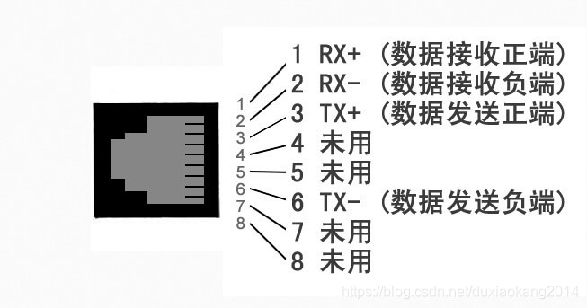
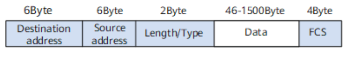

<!-- 让表格居中显示的风格 -->

# 
以太网基础
&emsp;&emsp;以太网是一种常见的局域网，早期的以太网无论是逻辑拓扑还是物理拓扑都是总线结构，之后发展出以集线器为中心结点的以太网，物理拓扑为星型，但逻辑拓扑仍未总线型，无法隔离碰撞域，称为**共享式以太网**。再之后出现以交换机为中心结点的**交换式以太网**，可以隔离碰撞域。

## 一、数据传输接口
&emsp;&emsp;以太网工作在数据链路层，MAC子层与物理层之间的通信是通过MII、RMII、GMII、RGMII等各种接口实现。
### MII接口
&emsp;&emsp;MII(Media Independent Interface)是介质无关接口，包括数据接口和管理接口，数据接口16根线。
&emsp;&emsp;传输速率为10Mbps时，时钟线(TXCLK、RXCLK)频率为2.5MHz;传输速率为100Mbps时，时钟线(TXCLK、RXCLK)频率为25MHz

|
信号线|
功能|
方向|
|:--|:--|:--|
|TXD[0:3]|数据传输(发送)|MAC ―> PHY|
|RXD[0:3]|数据传输(接收)|PHY ―> MAC|
TXCLK|发送时钟|PHY ―> MAC
RXCLK|接收时钟|PHY ―> MAC
TXER|发送数据出错|MAC ―> PHY
RXER|接收数据出错|PHY ―> MAC
TXEN|发送使能|MAC ―> PHY
RXDV|接收数据有效|PHY ―> MAC
CRS|载波检测，只有PHY半双工模式时有效|PHY ―> MAC
COL|冲突碰撞检测，只有PHY半双工模式时有效|PHY ―> MAC

&emsp;&emsp;注：表中 "发送" 和 "接收" 均从MAC角度出发
  

### RMII接口
&emsp;&emsp;RMII(Reduced Media Independant Interface),精简MII接口，节省了一半的数据线。RMII收发使用2位数据进行传输，数据接口8根线。
&emsp;&emsp;时钟线频率始终为50MHz。当传输速率为100Mbps时，每个时钟周期采集一次数据;传输速率为100Mbps时，每10个时钟周期采集一次数据，TX/RX数据需要在数据线上保留10个周期，相当于一个数据发送10次。

|
信号线|
功能|
方向|
|:--|:--|:--|
TXD[0:1]|数据传输(发送)|MAC ―> PHY
RXD[0:1]|数据传输(接收)|PHY ―> MAC
REF_CLK|参考时钟|MAC ―> PHY 或由外部时钟源提供
TXEN|发送数据使能|MAC ―> PHY
RXER|接收数据出错|PHY ―> MAC
CRS_DV|载波和接收数据有效|PHY ―> MAC

&emsp;&emsp;注：表中 "发送" 和 "接收" 均从MAC角度出发
  

### GMII接口
&emsp;&emsp;GMII（Gigabit Media Independant Interface），千兆MII接口，数据接口24根线。数据发送和接收均采用8根数据线，传输速率可达1000Mbps，工作时钟125MHz。同时兼容MII所规定的10/100 Mbps工作方式(8根数据线只用其中4根)。

|
信号线|
功能|
方向|
|:--|:--|:--|
TXD[0:7]|数据传输(发送)|MAC ―> PHY
RXD[0:7]|数据传输(接收)|PHY ―> MAC
GTXCLK|1000M发送时钟|MAC ―> PHY
TXCLK|10/100M发送时钟|MAC ―> PHY
RXCLK|接收时钟|PHY ―> MAC
TXER|发送数据出错|MAC ―> PHY
RXER|接收数据出错|PHY ―> MAC
TXEN|发送使能|MAC ―> PHY
RXDV|接收数据有效|PHY ―> MAC
CRS|载波检测，只有PHY半双工模式时有效|PHY ―> MAC
COL|冲突碰撞检测，只有PHY半双工模式时有效|PHY ―> MAC

&emsp;&emsp;注： 
&emsp;&emsp;&emsp;&emsp;1. 表中 "发送" 和 "接收" 均从MAC角度出发 
&emsp;&emsp;&emsp;&emsp;2. GTXCLK与TXCLK同时只有一个有效 
&emsp;&emsp;&emsp;&emsp;3. RXCLK频率是从收到的数据中提取出的，无需指定 
&emsp;&emsp;&emsp;&emsp;4. 虽然兼容MII接口，但与MII相比，发送时钟TXCLK/GTXCLK方向不同，由MAC发出。 

  

### RGMII接口
&emsp;&emsp;RGMII(Reduced Gigabit Media Independant Interface),精简GMII接口,数据接口12根线。相比GMII，数据发送和数据接受均采用4根线，但时钟频率却和GMII接口相同，因此，当传输速率为1000M时在时钟双边沿采样，同样兼容MII接口。

|
信号线|
功能|
方向|
|:--|:--|:--|
TXD[0:3]|数据传输(发送)|MAC ―> PHY
RXD[0:3]|数据传输(接收)|PHY ―> MAC
TXCLK|发送时钟|MAC ―> PHY
RXCLK|接收时钟|PHY ―> MAC
TX_CTL|发送数据控制|MAC ―> PHY
RX_CTL|接收数据控制|PHY ―> MAC

## 二、管理接口（MDIO接口）
&emsp;&emsp;MDIO是Management Data Input/Output的缩写，是专用于MAC与PHY管理的半双工串行总线接口，主要用于访问PHY的寄存器。MDIO接口最多可以挂载32个PHY设备。

|
信号线|
功能|
方向|
|:--|:--|:--|
MDIO|管理数据|双向
MDC|管理数据时钟|MAC ―> PHY

## 三、介质相关接口（MDI）
&emsp;&emsp;以太网物理层芯片PHY负责通过双绞线传输MAC子层输出到物理层的数据。PHY与传输介质（双绞线）之间的接口，称为介质相关接口（Medium Dependent Interface，MDI）。

&emsp;&emsp;常见MDI接口如下
- **100BASE-TX：** 传输速率100Mb/s，传输介质为两对双绞线，一对负责发送数据，一对负责接收数据，可实现全双工通信
- **10BASE-T1:** 传输速率10Mb/s，传输介质为一对双绞线，既支持全双工通信，又支持半双工通信
- **100BASE-T1:** 传输速率为100Mb/s，传输介质为一对双绞线，只支持全双工通信。
- **1000BASE-T1:** 传输速率为1000Mb/s，传输介质为一对双绞线，只支持全双工通信。

### RJ45接口定义

  

RJ45网线水晶头线序，分为 568A与568B两种标准：
将RJ45水晶头的金属触点面朝向自己，从左到右的线序(1 ―> 8)颜色依次为：
- **568A：** 绿白、绿、橙白、蓝、蓝白、橙、棕白、棕。
- **568B：** 橙白、橙、绿白、蓝、蓝白、绿、棕白、棕。

*568B与568A相比，相当于1，2两对线与3，6两对线互换位置*

由于线序标准的不同，又将网线分为于交叉线和直连线。

- **交叉线：** 一端是 568A标准，另一端是 568B标准的双绞线。
- **直连线：** 两端都是 568A标准，或者两端都是 568B标准。

&emsp;&emsp;现代交换机路由器的PHY芯片，大都带有自动识别转换功能，无论是交叉线还是直连线，均可自动转换连通。

## 四、PHY
&emsp;&emsp;PHY是物理接口收发器，它实现OSI模型的物理层。PHY在发送数据的时候，收到MAC过来的数据（对PHY来说，没有帧的概念，对它来说都是数据，而不管什么地址、数据还是CRC），然后把并行数据转化为串行流数据，再按照物理层的编码规则把数据编码，再变为模拟信号把数据送出去。收数据时的流程反之。PHY还有个重要的功能就是实现CSMA/CD的部分功能。

&emsp;&emsp;工业PHY是不需要指定PHY的master/slave角色的，两个PHY可以自己协商确定角色。但是在**汽车PHY中，角色需要静态配置，一个PHY事先设定为slave，另一个为master**，这么做的主要目的是减小link up的时间，因为汽车对启动时间有要求。两个千兆电口对接时，一端要工作在master模式，另一端则工作在slave模式。Slave一端不使用自己的时钟，而是从接收到的信号中恢复时钟，自己发送信号时就使用恢复出来的时钟。这样，可以有效保证双方的同步。为了提高链路建立的速度，主、从属性必须预先配置，不能自动协商。

## 五、以太网帧
### V2版本的以太网帧

  

