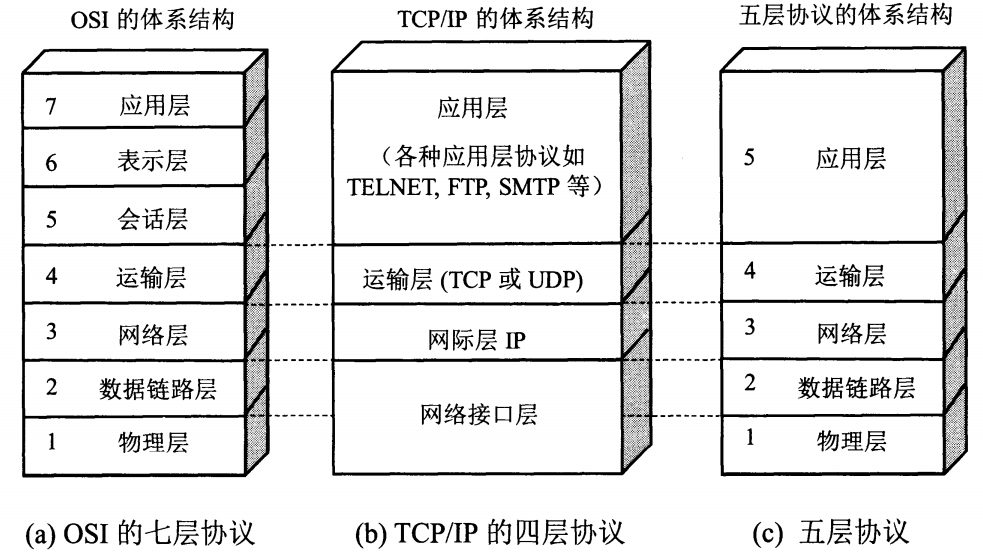
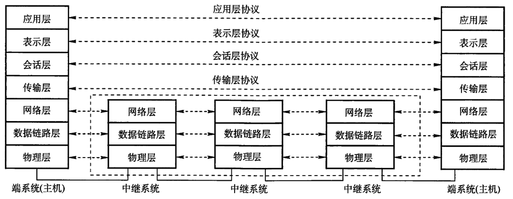
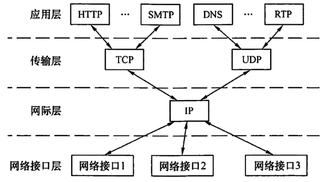
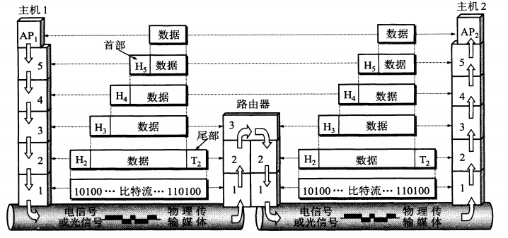

# 
计算机网络基础
## 一、分层网络模型

  
 

### OSI七层参考模型

  

* **应用层：** ==提供用户接口和应用程序之间的通信服务==。在这一层，用户可以访问各种网络应用程序，如电子邮件、文件传输和远程登录。
* **表示层：** 该层负责数据的格式化、加密和压缩，以确保数据在不同系统之间的交换是有效的和安全的。它还提供了==数据格式转换和语法转换==的功能。
* **会话层：** ==管理应用程序之间的通信会话==，负责建立、维护和终止会话。它还提供了数据的同步和检查点恢复功能，以确保通信的完整性和持续性。
* **传输层：** ==为应用程序提供端到端的数据传输服务==，负责==数据的分段==、==传输控制==、==差错控制==和==流量控制==。它主要使用 TCP（传输控制协议）和 UDP（用户数据报协议）来实现这些功能。
* **网络层：** 把网络层的协议数据单元从源端传到目的端，为分组交换网上的不同主机提供通信服务。对分组实现==路由选择==并实现==流量控制==、==拥塞控制==、==差错控制==和==网际互连==等功能。
* **数据链路层：** 将网络层传下来的IP数据报封装成帧。功能可以概括为==成帧==、==差错控制==、==流量控制==和==传输管理==。
* **物理层：** 在物理媒介上==透明地传输原始比特流==。

#### 通信子网和资源子网
低三层称为**通信子网**，是为联网而附加的通信设备，完成数据的传输功能。
高三层称为**资源子网**，相当于计算机系统，完成数据的处理等功能。
传输层承上启下。

#### 点对点和端到端
数据链路层实现点到点的通信，传输层实现端到端的通信。
* **点到点：** 主机到主机之间的通信，一个***点***指的是一个硬件地址或一个IP地址，网络中主机之间的通信是通过硬件地址或IP地址标识的。
* **端到端：** 运行在不同主机内的两个进程的通信，一个进程由一个***端口***来标识，所以称为端到端的通信。

### TCP/IP四层模型

  

* **TCP :** 传输控制协议(Transmission Control Protocol),数据传输单位为报文段，面向连接，能够提供==可靠==的交付。
* **UDP :** 用户数据报协议(User Datagram Protocol),数据传输单位为用户数据报，无连接，==尽最大努力==交付。

### 数据在各层之间的传递

  

* **服务数据单元(SDU):** 为完成用户所要求的功能而应传送的数据，即==从上层传下来的数据==。第n层的服务数据单元记为n-SDU。
* **协议控制信息(PCI):** 控制协议操作的信息，即==本层所添加的首部==。第n层的协议控制信息记为n-PCI。
* **协议数据单元(PDU):** 对等层之间传输的数据单位称为该层的PDU，即==本层传输的数据==。第n层的协议数据单元记为n-PDU。在实际的网络中，每层的协议数据单元都有一个通俗的名称，物理层的PDU称为==比特==，数据链路层的PDU称为==帧==，网络层的PDU称为==分组==，传输层的PDU称为==报文段==。

三者之间的关系：

n-SDU + n-PCI = n-PDU = (n-1)-SDU

&emsp;&emsp;即，本层SDU与本层PCI共同本层的PDU，同时本层的PDU向下层传输时作为下一层的SDU。

## 二、物理层
### 物理层接口特性
&emsp;&emsp;物理层的主要任务可以描述为确定与传输媒体的接口有关的特性。
1. **机械特性 ：** 指明接口所用接线器的形状尺寸、引脚数目、排列等。
2. **电气特性 ：** 指明在接口电缆的各条线上出现的电压的范围。
3. **功能特性 ：** 指明某条线上出现某一电平所表示的意义。
4. **过程特性 ：** 指明对于不同功能的各种可能事件的出现顺序。

### 码元与波特率
* **码元：** 指用一个固定时长的信号波形(数字脉冲)表示一个K进制数字，代表不同离散数值的基本波形，该时长称为码元宽度，该时长内的信号称为K进制码元。1码元可以携带若干比特的信息量。
* **波特率：** 码元传输速率，表示单位时间内数字通信系统所传输的码元的个数。
==若一码元携带n比特的信息量，则M波特率的码元传输速率对应 nM bit/s的数据传输速率==

### 数字数据和模拟数据
* **数字数据：** 离散的、非连续的数据，MCU发出的数据属于数字数据
* **模拟数据：** 连续变化的数据，如传感器采集到的数据

### 编码与调制
* **编码：** 将数据转换为数字信号
  * **数字数据 ――> 数字信号**：以太网
  * **模拟数据 ――> 数字信号**：对音频信号进行编码的脉码调制(PCM)
* **调制：** 将数据转换为模拟信号
  * **数字数据 ――> 模拟信号**：WIFI
  * **模拟数据 ――> 模拟信号**：语音数据加载到模拟的载波信号中传输(有线电话);频分复用技术(FDM),充分利用带宽资源

### 物理层设备
* **中继器 ：** 将信号整形并放大再转发出去，以消除信号经过一长段电缆后而产生的失真和衰减。只有两个端口，一个数据输入一个数据输出，两端口连接的网段属于同一局域网，两网段速率必须相同。
* **集线器 ：** 实际上就是一个多端口的中继器。不具备信号定向传送的能力，因此为了避免冲突，同时只能有一个端口输入。

## 三、数据链路层
### 组帧
&emsp;&emsp;两台主机之间传输信息时，必须在本层将网络层的分组封装成帧，以帧的格式进行传送。在数据的前后分别添加首部和尾部就构成了数据帧，帧长等于数据长度加首部长度加尾部长度，数据帧的帧长应在一定的范围内。

* **帧定界：** 首部和尾部中包含很多控制信息，可以确定数据帧的界限，即帧定界。
* **帧同步：** 数据帧的接收方应该能从接收到的二进制比特流中区分出帧的起始与终止（帧标识位）。
* **透明传输：** 不管数据是怎样的组合都应当能在链路上传输，防止数据中恰好出现与帧定界符相同的比特组合，导致数据传输错误的提前结束。

### 流量控制
&emsp;&emsp;由于收发双方各自的工作速率和缓存空间的差异，可能出现发送方的发送能力大于接收方的接受能力的现象。，流量控制实际上就是限制发送方的数据流量，使其发送速率不超过接收方的接受能力。
流量控制不是数据链路层特有功能，许多高层协议也提供此功能，只不过控制的对象不同，数据链路层流量控制对象为数据帧。

### 差错控制
&emsp;&emsp;由于信道噪声等各种原因，数据帧在传输过程中可能会出现错误（位错、帧错），差错控制可以使接收方接收到无错的报文。

* **位错：** 帧中的某些位出现了错误，通常可以通过CRC校验发现位错。通过自动重传请求（ARQ）重传出错的帧，接收方发现位错后将该帧丢弃，发送方超时重传该数据帧.
* **帧错：** 帧的丢失、重复或失序等都是帧错。在数据链路层引入定时器和编号机制，可以解决此类问题。

### 介质访问控制

&emsp;&emsp;数据链路层可以被进一步分为两个子层：**逻辑链路控制（LLC）子层** 和 **介质访问控制（MAC）子层**，介质访问控制属于MAC子层的功能，主要任务是为使用传输介质的每个节点隔离来自同一信道其他节点所传送的信号，协调各节点的数据传输任务。

* **LLC子层：** 与传输媒体无关，向网络层提供连接服务。
* **MAC子层：** 提供对物理层的同一访问，向上层屏蔽对物理层访问的各种差异。组帧拆帧、差错控制、透明传输等均在此子层实现。

&emsp;&emsp;常见的介质访问控制方法有信道划分介质访问控制、随机访问介质访问控制和轮询访问介质访问控制。其中前者是静态划分信道的方法，而后两者是动态分配信道的方法。

#### 信道划分介质访问控制
&emsp;&emsp;通过多路复用技术将信道的时域或频域进行划分，将多个信号组合在一条物理信道上进行传输，使多个终端设备共享信道。
* **频分多路复用：** 将多路基带信号调制到不同频率的载波上，再叠加形成一个复合信号，充分利用传输介质的带宽，系统效率较高。
* **时分多路复用：** 将一条物理信道按时间分成若干时间片，轮流地分配给多个信号使用
* **波分多路复用：** 光的频分多路复用，在一根光纤中传输多种不同波长（频率）的光信号
* **码分多路复用：** 采用不同编码来区分各路原始信号，既共享信道的频率，又共享时间。频谱利用率高、抗干扰能力强、保密性好，主要用于无线通信系统，特别是移动通信系统。

#### 轮询访问介质访问控制
&emsp;&emsp;在轮询访问中，通过一个集中控制的监控站，以轮询方式轮询每个结点，再决定信道的分配，同一时间只有一个结点可以使用信道。比较典型的协议令牌传递协议。
&emsp;&emsp;在令牌传递协议中

#### 随机访问介质访问控制
&emsp;&emsp;在随机访问协议中用户可以能够根据自己意愿随机地发送信息，占用信道全部速率，但在总线型网络中，两个或多个用户同时发送信息时可能会发生**碰撞**，导致所有冲突用户的发送均失败。
&emsp;&emsp;为了解决数据传输过程中发生的碰撞，每个用户需要按照一定的规则反复重传它的帧，直到该帧无碰撞地通过。随机访问介质访问控制实质上是将广播信道转化为点对点信道，其核心思想为：各发送结点争用同一信道，胜利者独享整个信道，各节点既不共享时间，也不共享频率。
&emsp;&emsp;常用的协议包括：ALOHA协议、CSMA协议、CSMA/CD协议和CSMA/CA协议

****
**CSMA/CD协议**
载波监听多路访问/碰撞检测

&emsp;&emsp;==适用范围==
&emsp;&emsp;&emsp;&emsp;总线型网络或半双工的网络环境

&emsp;&emsp;==工作流程==
&emsp;&emsp;&emsp;&emsp;1. 发送数据前对信道进行监听
&emsp;&emsp;&emsp;&emsp;2. 检测到信道空闲进行数据发送
&emsp;&emsp;&emsp;&emsp;3. 数据发送过程中持续监听信道，检测是否发生碰撞
&emsp;&emsp;&emsp;&emsp;4. 当检测到发生碰撞后立即停止发送
&emsp;&emsp;&emsp;&emsp;5. 等待一段随机时间后重新尝试发送数据

&emsp;&emsp;==信道争用==
&emsp;&emsp;&emsp;&emsp;电磁波在总线上的传输速率是有限的，因此，当某个时刻结点检测到信道空闲时，信道并不是真的一定就空闲。即，信号的传输过程中也有可能与其他结点发送的信号产生碰撞。
&emsp;&emsp;&emsp;&emsp;设A、B两结点进行通信，AB之间的传播时延为t,则结点A最长等待2t时间就能能得知发出的数据是否发生碰撞，结点B同样如此。因此把以太网端到端的往返时间2t称为**争用期**。
&emsp;&emsp;&emsp;&emsp;规定以太网争用期为51.2us，则队于 10Mb/s 以太网结点来说，争用期可以发出的帧长为512bit (51.2 x 10^-6^ x 10 x 10^6^)。规定以太网帧的最小帧长为64B，则当某结点收到的数据帧小于64B时，则说明该数据帧在传输过程中因为发生碰撞而异常中断，结点应丢弃该数据帧。

&emsp;&emsp;以太网最小帧长为64字节
  

****
### 数据链路层设备
* **网桥 ：** 工作在MAC子层，可以隔离冲突域，两个以太网通过网桥连接之后可以成为一个范围更大的以太网，而原来的每个以太网就成为一个网段。
* **交换机 ：** 可以看作一个多端口的网桥

